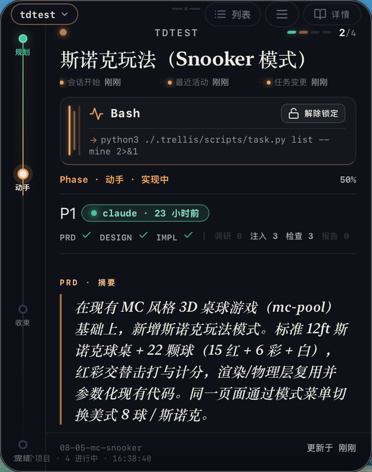
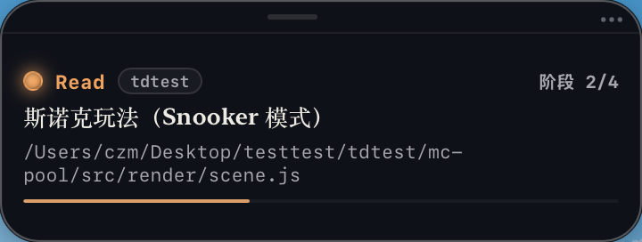
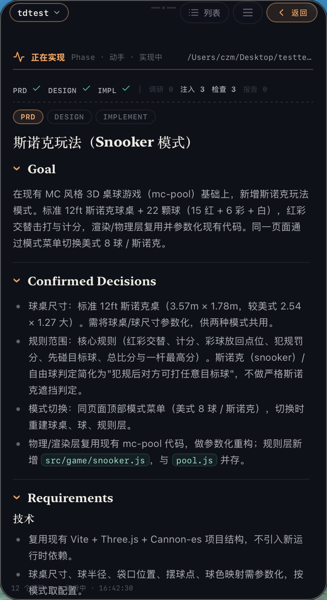
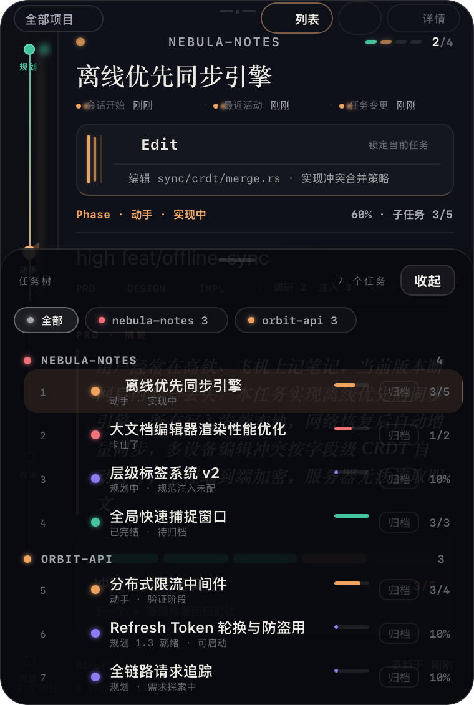
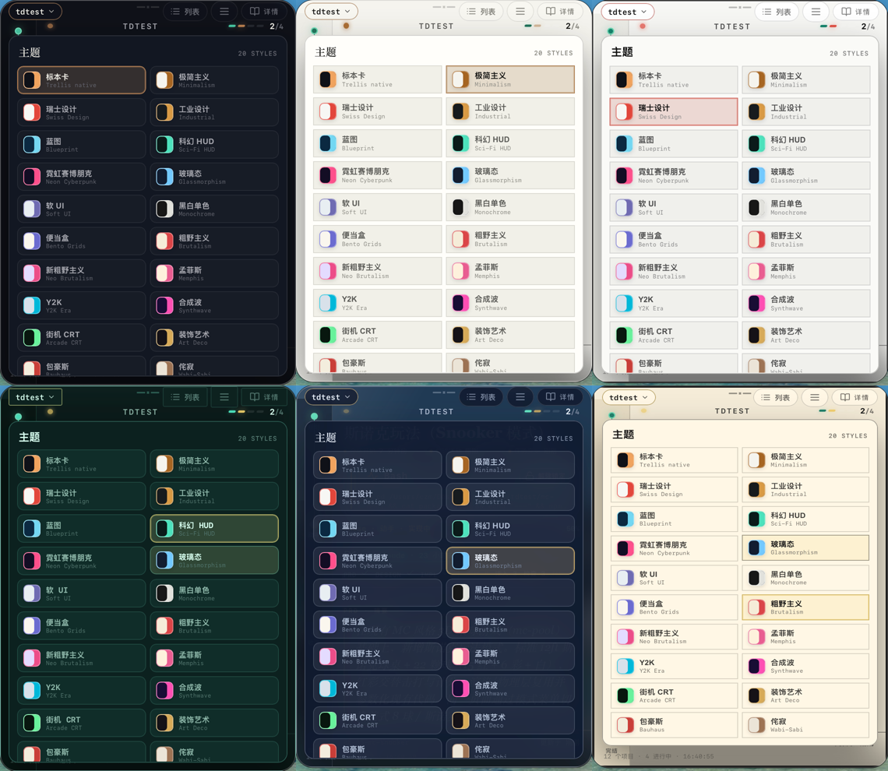

# Trellis Card

> 常驻桌面的 Trellis 任务与 Agent 活动观察者。

Trellis Card 是一款 macOS / Windows / Linux 桌面端小工具，以「卡片」和「胶囊」两种形态实时展示 Trellis 项目中的任务进度与 Agent 活动。它不修改任务，只负责让你一眼看清当前在发生什么。

## 支持的系统

| 系统 | 安装包 |
|---|---|
| **macOS**（Apple Silicon + Intel） | `.dmg` |
| **Windows**（x64） | `.exe` / `.msi` |
| **Linux / Ubuntu**（x64） | `.deb` / `.AppImage` |

## 支持的 Agent

| Agent | 接入方式 | 采集内容 |
|---|---|---|
| **Codex** | 应用侧写入 `~/.codex/hooks.json` | 会话开始、工具活动、任务绑定 |
| **Claude Code** | 应用侧写入 `~/.claude/settings.json` | 会话开始、工具活动、任务绑定 |
| **Cursor** | 应用侧写入 `~/.cursor/hooks.json` | 会话开始、工具活动（纯观察者） |
| **Pi** | 用户级全局扩展 `~/.pi/agent/extensions/` | 会话开始、用户 prompt、工具活动（纯观察者） |
| **OpenCode** | 用户级全局插件 `~/.config/opencode/plugins/` | 用户消息、工具活动（纯观察者） |



## 核心特性

### 1. 生命周期状态感知

Trellis Card 把任务的生命周期压缩成四种可感知的状态：

- **规划中** — 需求探索或 PRD 已就绪
- **运行中** — Agent 正在执行 / 验证
- **等待授权 / 被阻塞** — Agent 暂停，等待用户授权或人工确认
- **已完成** — 任务结束，等待归档


卡片聚焦当前最重要的任务；任务树则一眼看完全部生命周期颜色。

### 2. 卡片 ↔ 胶囊双形态

- **卡片模式**：完整展示聚焦任务、阶段、进度、子任务、PRD 摘要与文档入口。
- **胶囊模式**：360×136 的极简条，浮在工作区一角，不打断当前应用。




### 3. 翻面查看任务详情

点击「详情」翻到卡片背面，直接阅读 PRD、DESIGN、IMPLEMENT、验收报告与 research 文档，无需离开桌面。



### 4. 任务树、项目筛选与多项目观察

任务树列出所有任务层级，支持按项目筛选；扫描根目录或让 Hook 动态发现项目后，一个窗口就能同时观察多个 Trellis 仓库。



### 5. 20 款主题

内置 specimen、synthwave、blueprint、glassmorphism、neo-brutalism、bento 等 20 种视觉主题，随时切换。



### 6. 托盘常驻

关闭窗口即隐藏到托盘，不会误退；随时从托盘唤回。

## 快速开始

### 直接下载使用

在 [Releases](../../releases) 页面按平台下载对应安装包：

- **macOS**：下载 `.dmg`，拖拽安装后即可运行。
- **Windows**：下载 `.exe` 安装程序或 `.msi`，双击安装。
- **Linux / Ubuntu**：下载 `.deb`（`sudo dpkg -i Trellis-Card_*.deb`）或 `.AppImage`（`chmod +x` 后直接运行）。首次运行前需安装系统依赖：

  ```bash
  sudo apt install libwebkit2gtk-4.1-0 libayatana-appindicator3-1 librsvg2-common
  ```

### 开发运行

```bash
npm install
npm run dev        # tauri dev
```

### 构建

```bash
npm run build      # tauri build
```

### 接入 Trellis 项目

首次启动有两种方式：

1. **扫描已有项目**：选择一个根目录，自动发现其下的 Trellis 项目。
2. **从零开始**：先进入空卡片；在「设置」中为 Agent 安装 Hook 后，Agent 运行 Trellis 项目时会自动导入。


Hook 只需安装一次，即可观察多个项目。若已进入主界面，可按以下路径配置：

1. 点击卡片右上角的三横线，打开「观察菜单」。
2. 在「配置」区域点击「设置」。
3. 在「Agent 接入」中选择 `Codex`、`Claude Code` 或 `Cursor`，点击「安装」。
4. 重启对应 Agent；此后它在 Trellis 项目中的活动会自动出现在卡片中。

> 说明：Cursor 的 hook 是纯观察者，只采集 `sessionStart` / `preToolUse` / `beforeShellExecution` / `stop` / `sessionEnd` 事件，不参与权限决策，也不会阻断或修改命令。由于 Cursor 不暴露「等待授权」事件，卡片上 Cursor 会话以「运行中 / 空闲 / 一轮完成」为主。

「设置」会显示 Hook 是否已安装；需要停止接入时，点击同一位置的「移除」即可。应用只管理自身写入的 Hook，不会改动其他配置。

## 操作速查

| 快捷键 | 动作 |
|---|---|
| `L` | 打开/关闭任务列表 |
| `C` | 切换卡片 / 胶囊模式 |
| `R` | 刷新 |
| `Esc` | 关闭菜单/弹层 |
| `↑/↓` | 在列表中移动焦点 |

## 技术栈

- **桌面端**：Tauri 2 + Rust
- **前端**：原生 JavaScript / CSS（无框架），GSAP 动画
- **通信**：Unix socket + inbox 队列接收 Agent Hook 事件
- **文件监听**：notify 实时感知 `.trellis/tasks` 变化

## 友链

- LinuxDo — https://linux.do

